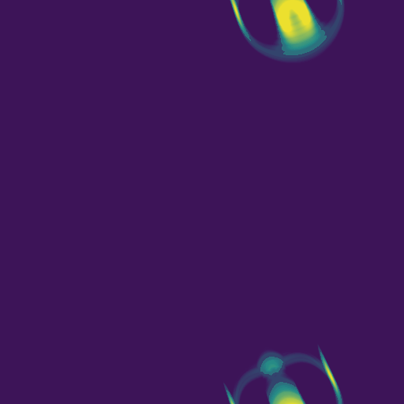

# Lenia
Lenia is a space, state and time continuous cellular automaton.

This is an implementation of it in [Uiua](https://uiua.org)!

Check out [this website](https://chakazul.github.io/lenia.html) for further
reading on Lenia. This page also served as my main source of information.

You can find a jupyter notebook called "From Conway to Lenia" on there,
which was great to follow along.

The example uses [raylib](https://github.com/donstenzel/raylib-uiua) to
render the simulation as it happens, thus allowing much longer and bigger ones.
The performance gets worse as the world gets bigger and at some point won't
be able keep up, but from testing sizes up to 500x500 work pretty well.

## Pad

You can import the repo in the pad to use creatures and functions.
```uiua
# Experimental!
~ "git: https://github.com/donstenzel/lenia"
  ~ Creatures Lenia

# New orbium, pad for space
Creatures!(Pad 22_22 Orbium)

# Simulate 100 frames, color with Viridis
Lenia!(C Viridis Single~Sim 100)

# Upscale
≡(▽⟜≡▽)4
```
This shows 100 frames of Orbium casually gliding.
[[Pad link]](https://uiua.org/pad?src=0_16_0-dev_1__IyBFeHBlcmltZW50YWwhCn4gImdpdDogaHR0cHM6Ly9naXRodWIuY29tL2RvbnN0ZW56ZWwvbGVuaWEiCiAgfiBDcmVhdHVyZXMgTGVuaWEKCiMgTmV3IG9yYml1bSwgcGFkIGZvciBzcGFjZQpDcmVhdHVyZXMhKFBhZCAyMl8yMiBPcmJpdW0pCgojIFNpbXVsYXRlIDEwMCBmcmFtZXMsIGNvbG9yIHdpdGggVmlyaWRpcwpMZW5pYSEoQyBWaXJpZGlzIFNpbmdsZX5TaW0gMTAwKQoKIyBVcHNjYWxlCuKJoSjilr3in5ziiaHilr0pNAo=)

# Showcase 📷

## Lenia
This is classic Lenia, showcasing continuous states, time and space.


## Orbium
The Orbium was one of the first creatures to be found inside Lenia.



## Wanderer
The Wanderer is produced using asymptotic growth. This makes the creature
smoother and more defined.


## Smooth glider spawner
This creature lives in the multi-channel extension to Lenia, where
kernels have different input and output channels, producing an even
more elaborate result.


## Tesselatium gyrans
This species also lives in multi-channel Lenia, and manifests in multiple
different forms.


These renders of Tesselatium gyrans clearly demonstrate that
creatures in Lenia can possess cohesion and rigidity in their structure.
Even when meeting one another, they simply bounce. They also show swarm
behaviour when moving side by side.


# Final words
I find it truly fascinating to see how complex structures like these can
arise from relatively simple rules.

Writing the code for this was actually really simple. Once I had wrapped my head
around what we're trying to do, implementing it in Uiua was a breeze. It really
excels at working with lots of inputs in parallel. In particular, implementing
further 'upgrades' like multiple rings in the kernel, multiple kernels and
multiple channels were all easily done.